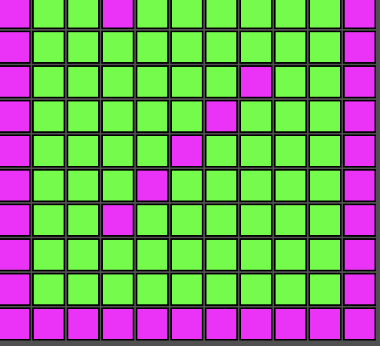

# MATRIX (but nicer 😎)

### First thing first
```
npm install
```

### For husky activation
```
npm run prepare
```

### Init the Vite server
```
npx vite
```

### Check the test stuff
#### In order to test, open another terminal window and then use the following
```
npm run test
```
# How it works
### Is the same matrix you have to build, but created in a sugar nicer way ✨✨✨
#### I'm using all the knowledge you gathered along the course (nothing strange or weird, I promise)

# Nice explanation
#### First, we need to gather the .csv data in a way we can handle.
```javascript
//Fetch the data
let game: MapElem[][]; //this variable will represent our matrix along the code
p.setup = () => {
  fetch("../data/map.csv", {
    //the path of our local file
    headers: { "content-type": "text/csv;charset=UTF-8" },
  })
    .then((raw: any) => raw.text()) //transform the raw data into string
    .then((data: string) => {
      //here we have access to the data in string format
      //as we have access to a bunch of chars and commas, we need to transform it to objects
      game = data.split(/\r?\n/).map((chunk: string) =>
        chunk.split(",").map((obj: string) => {
          //According to the value we set the object type
          //At this point, the posx and posy does not matter at all, I will set that later
          switch (obj) {
            case "1":
              return new Wall(0, 0);
            case "3":
              return new Player(0, 0);
            default:
              return new Ground(0, 0);
          }
        })
      );
    });
};
```
#### Before we continue, there is an important notion to settle down
#### We need to get track 
```javascript
const getPlayerReference = (_game: MapElem[][]) => {
    const playerRow = _game.findIndex((l: MapElem[]) => l.find((j: MapElem) => j instanceof Player));
    const playerIndex = _game[playerRow].findIndex((j: MapElem | Player) => j instanceof Player);
    const player = _game[playerRow][playerIndex];
    return { playerRow, playerIndex, player };
  };
```
#### Now, in the draw is where the nice stuff happens
```javascript
  p.draw = () => {
    p.background(80);
    const { player } = getPlayerReference(game);
    for (let i = 0; i < game.length; i += 1) {
      for (let j = 0; j < game[i].length; j += 1) {
        game[i][j].setX(j * 20);
        game[i][j].setY(i * 20);
        game[i][j].show(p);
      }
    }
    if (player instanceof Player) {
      player.getBullets().forEach((bullet: Bullet, bulletIndex: number) => {
        bullet.show(p);
        if (bullet.getX() > 500) {
          player.spliceBullet(bulletIndex);
        }
        const callBack = (row:number, col: number) => {
          game[row][col] = new Ground(0, 0);
          player.spliceBullet(bulletIndex);
        };
        bullet.shoot(callBack, game);
      });
    }
  };
```
